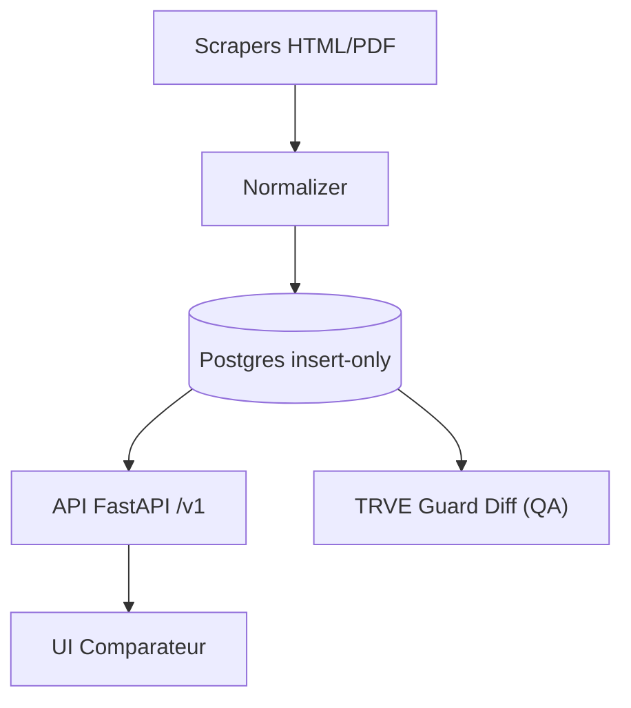

# 🧱 Architecture (vue d'ensemble)

# 🔌 Flux de données
1. **Scrapers** récupèrent HTML/PDF → checksum SHA-256
2. **Normalizer** mappe vers contrat `tariff.schema.json`
3. **Storage** `INSERT` uniquement (clé idempotente)
4. **API** expose `/v1/tariffs` (latest) & `/v1/tariffs/history`
5. **QA** compare vs **TRVE** pour badges et alertes

# Badges / Etats
- **fresh** : observation ≤ 7 jours, aucune alerte active.
- **verifying** : vérification en cours (changement détecté ou diff TRVE à confirmer en < 48 h).
- **stale** : observation > 14 jours.
- **broken** : parser en échec ou données rejetées.
